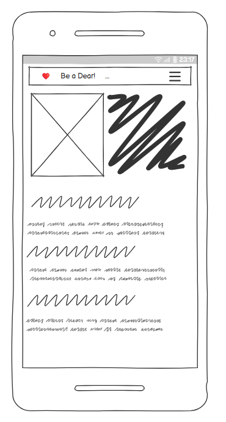
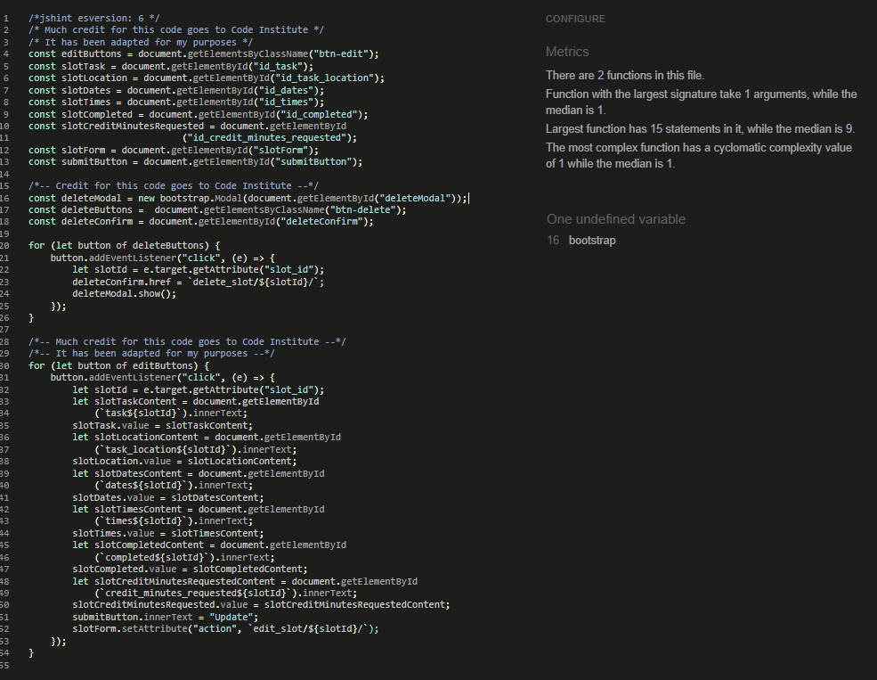
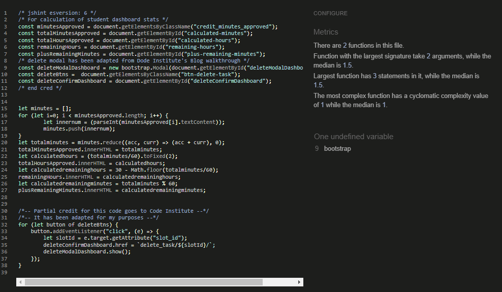
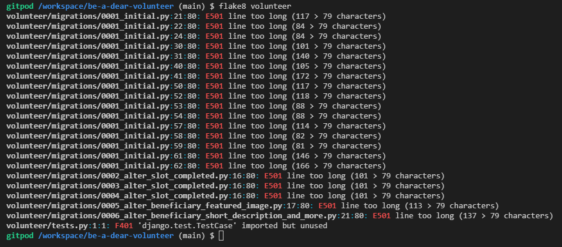
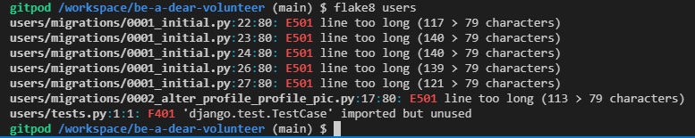
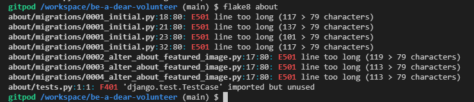
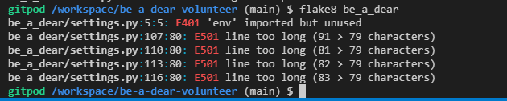

# Be a Dear - Volunteer
A Django project utilizing python, javascript, HTML, and CSS. 
# REMEMBER TO INCLDUE LINKS TO HEROKU AND GITHUB HERE!!!!

## Description
Be a Dear - Volunteer is a web-based application designed to allow high school students to plan and record their volunteer activities and to request credit toward their graduation requirement, which is typically 20 to 30 hours for high schools in California.

The application is a fictional project by the fictional West Carlsbad High Schools student council. Students are usually required to volunteer at public-facing organizations. The idea behind the project is to allow students to volunteer in non-traditional ways, such as by assisting a private individual in their community. In addition to being able to volunteer for private citizens, students are allowed to volunteer for as little as five minutes at a time as part of the fictional project.

The Be a Dear project as a whole contains three apps:
1. The Volunteer app, which houses all of the front-end CRUD for the project. 
    -   Beneficiary and Slot are the main models of this app, and the only ones involved in front-end CRUD.
        -   It is with these objects that the user interacts to view volunteer opportunities (the various beneficiaries listed on the site) and save those opportunities as "tasks" (called     slots in the model and in the code). They are able to create, read, update and delete their tasks, both from the page where they save them to their dashboards and from the dashboard itself.
    -    A third model in the app is Classroom (which is connected to a Profile model in the Users app). 
        -   The current purpose of Classroom is that it enables teachers to sort user profiles (see below) by Classroom in the admin panel.
        -   On the front end, students see whether or not they have a profile set up, and in that case, which classroom they are assigned to.
        -   The model will enable future functionality, such as a competition between classrooms, teacher pages with front-end ability to approve student credit, classroom pages, etc. 
    - Volunteer app templates include:
        -   the homepage, 
        -   beneficiary page ("shown to the user as "volunteer"), where users browse opportunties and can access the beneficiary detail page through links
        -   beneficiary detail page (save tasks to their dashboard and/or edit and delete tasks), 
        -   the student dashboard, where students manage their tasks.
        -   the update task form, where users editing tasks from the dashboard (only) are sent
2. The About app, which houses the About model and a contact form.
    -  The extra contact form template allows users to send messages from all the main pages of the website and be returned to the page they messaged from.
3. The Users app
    - Contains a single model, Profile, which is linked to Django allauth Users model and to the Classroom model in the volunteer app.
        - The Profile model provides limited functionality at the current stage of this project, but it does allow for rapid development of future enhancements.

MOVE THIS TO USER STORIES SECTION
Teachers are identified as such on the back end by the superuser--both by labeling them as "staff" with Django's built-in User model and by changing their default profile type to "teacher"--and, after being given the relevant privileges there, are able to view their students' requested hours and approve them, either for the full amount requested or some other amount, as they deem creditable. (After all, high school students are known to exaggerate!)

Students can save opportunties to their personal dashboards to plan their activities, they can enter time to request credit for, and they can see the status of their credit requests, as well as their total hours approved and the number of hours and minutes still required of them in order for them to graduate. They can also see what other students are planning or have done, and they can suggest the addition (posting to the site) of particular beneficiaries so that their fellow students can be informed of them. 
## Purpose
Traditionally, students must volunteer for public-facing organizations, such as at a soup kitchen, food bank, animal shelter, or environmental group, in order to have their volunteer time approved for credit. In reality, many students never complete their hours but instead have their parents sign off on work never done. (I know this because I have neices and nephews who've told me so!) And a quick Google search of the issue reveals that many, if not most, students consider the requirement just an additional hoop to jump through in order to graduate; they resent the requirement and gain little from their experiences, including any motivation for future volunteerism. One purpose of the project is to allow students to volunteer in more convenient ways--more locally and for smaller increments of time. The COVID-19 pandemic caused increased mental health issues among teenagers, so another purpose of the project is to improve the mental health of students. It is well-known that when people help others, even in tiny doses, it increases their own happiness and self esteem. Finally, college acceptance is extremely competitive in California, especially for the cheapest schools, the public universities, which are also the highest ranked in California. Colleges do look at the extracurricular activities of applicants, including their volunteer experiences, and they read college application essays as an important part of the screening process. It is hypothesized that students who volunteer by helping an elderly neighbor on a regular basis, for example, will have more to say about their experiences on a college application, potentially helping their changes of acceptance. One of the (actually) stated rationales behind having students volunteer is that they will gain experiences in the public sphere that can help them in future employment. While this may be the case (for a very small number of cases, I'd venture to guess, as many students work part time jobs anyway), it is my belief that experiences of real people and real problems in their communities would be of more benefit, especially when it comes to an awareness of society as a whole. Working at a soup kitchen is a wonderful thing, but the gulf between volunteers and those helped is often too wide for the experience to give real personal meaning to many teenagers. It is thought that more regular experiences with people closer to them in the community could yield more meaningful experiences due to the immediacy and social intimacy of the personal relationships formed. The hope is that students, who can be quick to reject externally imposed notions of morality, will come to enjoy their encounters and will learn an important fact about being human: that a great reason for helping others is that it makes us feel good, too.

## UX
The design of the website is simple and straightforward. Students are not expected to spend their leisure time visiting the site, so there is no point trying to make it flashy. The point of the app is much more utilitarian, and the design reflects this. Future functionality, such as the ability of students to post about their experiences, share photos, etc., would likely merit enhanced design, but for the scope of this project, simplicity is key. Students will want to quickly find what they are looking for and be able to navigate freely and intuitively from the different pages, being redirected to where they started out after completing a task in the app. For this reason, students are able to read, edit and delete their tasks from two different places on the site. From the beneficiary detail page they can quickly add tasks to their dashboards without worrying about including all of the details. They can create, read, update and delete from there, without ever having to leave the page. This means they can quickly add a number of tasks related to the different beneficiaries to their dashboards for later updating as they wish. Later, from their dashboards, they can read, update and delete their tasks, filling in the details and requesting credit as they go. Editing or deleting from the dashboard returns the student to the dashboard, and editing or deleting from the beneficiary detail page keeps users on the beneficiary detail page.

Other links are also made convenient. Any visitor to the site can send a message by clicking on "Contact Us" in the navbar, by clicking on an inline link on the homepage, or by filling in the form on the About page. All users have access to the Home, About, and beneficiary details pages (accessed by clicking on a beneficiary). (Only logged in users can save tasks to a dashboard.)

The navbar includes only those links that are relevant to the user. Non-logged-in users see Home, About, Contact Us, Register, and Log In. Logged in users see Home, About, Contact Us, Log Out, and My Dashboard. All visitors to the site see a message under the navigation items either telling them that they are logged in as ( their username) or that they are not logged in, as the case may be. The message is shown on all pages.

Clear messages are displayed to users indicating the results of any action taken by them, such as successful creation, updating or deleting of slots, or alternatively, if they try to visit a page to which they don't have access by typing in the url. 404 messages are in place as well. Delete modals are used to warn users before they delete anything.

Pagination is not used, as most students are expected to be accessing the site on their mobile phones, where infinite scroll is more convenient. If any enhancement were to be made in the future, it might be the ability to search for an organization by name or by first letter by clicking on letters of the alphabet, but this would only be useful if there were to be very many organizations, and this would not be expected to be the case. In any case, the current scope of the project does not merit this.

Privacy is maintained, as usernames and information about planned tasks, etc., are never shown (at least not by name) on the pages that are not strictly personal to the logged in user. (In a future version of the app, aliases could be displayed on public pages, based on the aliases users choose for their profile.)

The main font used is open-sans for easy readability and clean presentation. The exception is the use of Graduate in the navbar as a nod to the high school milieu, and the limited use of Cabin Sketch on the dashboard page, as it looks like a student's doodle on a notebook or like block letters written with chalk on a chalkboard.

The color scheme is simple and clean, mostly black and white, with some light pink background in places which helps break up the page into easily recognizable sections while maintaining good contrast with the font color (universally black, except when white on a black background).

The Register, Log In and Log Out pages and forms are simple and straightforward, and the user is asked to verify that they really want to log out. If a user tries to log in before creating an account, they are asked to register first. If a user forgets their password, there is a clear, convenient link and instructions to send the site owners a message from the login page.

## Wireframes

My earliest wireframe was created using [Balsamiq](https://balsamiq.com/), but my free trial period ended before I was ready to use it here, so I am including a downloaded image of it here:

More extensive wireframes were done in Miro (below). The home page differs from the design, as I was advised to include more explanatory information about the app on the homepage, so another section between the header and the list of beneficiaries was added.

## User Stories
A site visitor can 
- read about the project on the home page and on the about page
- and they can send messages from either page through a contact form.

A site visitor can log in and create an account to:
- read about volunteer opportunities
- read about what other students have signed up for
- see a count of how many students have saved and how many have completed tasks related to a specific beneficiary
- save opportunities (i.e., create "tasks" related to a beneficiary) to their dashboard
- create, read, update and delete tasks from the beneficiary detail page
- manage their tasks (read, update and delete) on their student dashboard
- request credit by updating the fields "completed" and "credit minutes requested" on the update form
- quickly see (via color coding on the dashboard) which tasks are planned, or completed, or have credit minutes/hours requested, or have already received credit
- compare the amount of credit received with the amount they requested (in case they want to argue their case for more minutes of credit!)
- see how many hours and minutes of credit they have received in total
- see how many more minutes or hours they must complete toward graduate
- see whether they have been assigned to a classroom, and if not know what to do if they haven't
- send messages to the site owners to suggest the posting of new volunteer opportunties, or for help with a forgotten password
- log out

The superuser can:
- designate certain registered users as "staff" (from the is_staff attribute from Django's allauth), to allow them to access the admin panel
- designate those users as either teachers or school admins and give them restricted privileges (as "staff", see above) in the admin panel
- assign classrooms to the teachers (or a default "unassigned" classroom 999 in the case of school admins)
- create a user profile for any user, inline in the admin panel, assigning classrooms to students and teachers, and uploading profile pictures for display on student dashboards
- add new beneficiaries and new tasks, and update and delete them
- create, read, update and delete text for the About page, including uploading images
- mark received messages as read in order to keep track of what has been done (or answered)
- add classrooms for the project (create, read, update and delete functionality for this)

A teacher can:
- log in as a regular user and enjoy full functionality as if they were a student
- get access to the admin panel, once approved by the superuser
- be given the ability to approve students' requests for credit (i.e., can update slots)
- approve either the amount requested or a different amount, as the fields for credit requested and credit approved are distinct
- read information about all beneficiaries, slots, homerooms, users, and profiles on the back end
- sort profiles by classroom to see a list of all students in a classroom that are registered
- check if a student has been assigned a homeroom
- send a message through the admin panel
- read messages in the admin panel

## Features

### List of beneficiaries

Students can browse a list of beneficiaries with short descriptions and locations, with a link to read more about each and to add the beneficiary to their dashboard for planning their volunteer activities. The list includes the beneficiary categories "An Individual" and "Other Organization or Group" so that students can plan volunteer activities not included under an already listed beneficiary. Through the contact form on the About page, students can send suggestions for posting opportunities they know of so other students can become aware of them.

### Task creation

On the beneficiary details page, users can read more about volunteer opportunities involving a particular beneficiary, find contact information to investigate further, and can enter information concerning the task they plan to (or have already) performed for that beneficiary. Here, users fill in a short task description and task_location (as this might differ from beneficiary location), and optionally, the date.  

### Student dashboard

Here students can track, edit, update, or delete their planned activities ("slots"), which appear on their own pages under the rubriques Planning, Completed, Credit Requested (in terms of minutes), and Teacher Approved (in terms of minutes credited). They also see their total minutes credited.
Under the Teacher Approved rubrique are displayed both the minutes of credit requested by the student and the minutes of credit approved by the teacher, so that any discrepancies can be discussed by the teacher and student and then resolved, as teachers will not necessarily want to approve the same number of minutes requested by the student.

### Teacher approval in the admin panel

Teacher ability to approve their students' activities and hours and minutes for credit toward graduation on the backend. Teachers receive the is_staff attribute on the backend by the superuser and are given the ability to log in to the admin panel, where they can sort students by homeroom to make the approval process easy.

### User Profiles

Users can have profiles that consist of a profile picture, classroom to which they belong (relating to a separate classroom model), profile type (student, teacher, or school admin), and alias, which defaults to "Someone". The classroom attribute is the most important attribute of the model because it allows teachers to quickly identify on the back end which students they want to validate slots for. The superuser changes any teachers' profile type from the default student to "teacher" and then manually gives the teachers various permissions on the admin panel. When a teacher later accesses the admin panel, they can sort profiles by homeroom to view the students they are interested in.

At the moment, profiles are handled entirely on the back end. Thanks to being registered as inline with the user model in the admin.py file of the users app, profile creation is straightforward. When a new user is created in the admin panel, or when a previously added user is viewed, the fields for the Profile model appear as well, so the superuser can assign the correct profile attributes, such as homeroom, or a profile picture that differs from the default. See future enhancements for more about user profiles.

## Future enhancements

- Profiles auto created through signals

- Homeroom page counter showing total minutes of volunteer time completed and approved by the students in the class as a whole.

- Downloadable signature Forms: Credit for volunteer work by high school students in the State of California, as a matter of fact and not merely by the design of this project, requires proof in the form of signatures and contact details of the beneficiary. (For this reason, students have traditionally been limited to volunteering for public-facing organizations or institutions.) Students will be able to download signature forms to provide a basis for teacher approval of their volunteer hours.

## Data Models

### Entity Relationship Diagram

Please note that all fields descriptions were not available for use through the DrawSQL site (at least the free version). Image fields in the About, Profile, and Beneficiary models should indicate BLOB for type, rather than BigInt.

## Validation

### CSS

### HTML
Early attempts at validation revealed a number of issues with the HTML. In particular, because several of the project's models use Summernote fields, and these are rendered in HTML templates as paragraphs, each place I had wrapped a tag referring to those object attributes with my own paragraph in the html, this caused an error of having a paragraph wrapped in another paragraph, which is nto allowed in html. Thta is, my original html looked like this `
<{{beneficiary.beneficiary_description | safe }}
`. I resolved this error by changing my own paragraph tags to article tags. Another widespread error was that bootstrap's "card-text" class was setting the font-face to Aptos, which is no longer supported. I used CSS to override that, setting the font back to my open-sans preference with an `!important` tag for any element (or child of an element) with class "card-text".

### Javascript

Javascript files were run through JSHint and passed with no errors. No changes have been made to the js files after being passed through the linter, except to remove the coded out first line, visible in the images below, needed to run the linter for ES6.

### Python

Python files were run through the Flake8 linter, with the results shown below. Files created by Django, such as migrations or tests.py were ignored. There are no outstanding errors from any files that I created or edited. I decided it was safe to ignore the errors thrown by tests.py files from the apps, as they involved only the unnecessary import of TestCase from the django test library, and I will need that import if I decide to do automated testing at a later date. And although I probably didn't need to, I went ahead and ran manage and env python files through the linter as well. As you can see, the only errors were for line length in the env file, but my attempt to resolve those led to errors connecting to the database, so I decided to return the file to its original long-line-length form. For some reason, my editing of the slot model simply for line length during cleanup in response to an error shown by flake8 caused django to consider the model altered (which I discovered by running makemigrations --check), so I decided, before running the migration, to also make a last minute change to a char field in the beneficiary model, increasing its max-length, before running the migration. Therefore, I ran the volunteer app through flake8 again, with no errors. The newest result is shown below.

[Results for manage and env files](flake9-manage-env.png)

## Bugs!

The default images were not being loaded for the About, Profile or Beneficiary objects.
**Fix:** Change default to "placeholder", rather than "default.jpg" or "placeholderimage.jpg", then load the relevant placeholder images conditionally in the templates.

:worried: The Slot Form (from the beneficiary detail page) was not posting correctly to the database when a user tried to edit. Although it would populate with the two first fields, it would then create a new Slot object. The reason for the bug is that I wasn't (originally) displaying all of the attributes in the rendered html template, so the javascript could not pick up all of the relevant attributes to edit. This threw errors and did not allow the javascript to run to the end of the function (where it should then change the button from "Save to Dashboard" to "Update").
**Fix:** I decided to render all of the objects attributes in the template so that they could be picked up by the javascript for editing, allowing the js function to complete, and thus allowing successful editing of the object. I considered making some of the attributes "hidden" using CSS classes, but further research revealed that javascript would not pick up any such hidden attributes. On further consideration, I thought that showing all of the attributes actually improved user experience and furthered one purpose of the project, which was to have students be able to read about what others were doing. That is, there was no harm, but to the contrary, some benefit, in rendering all of the objects attributes in the templates. As an afterthought, if I had truly wanted to hide the objects' attributes in the rendered templates, I could have simply made them display in the same font color as the background. However, I seem to recall learning that that is not good practice. So my solution in that case would be to use a different method of enabling the editing of objects, such as by using an update form, as is done from the student dashboard page. In any case, at first my solution did not work, and I discovered that I had a number of typographical errors in my javascript (in `slots.js`). Many thanks to Code Institute Tutor support for helping me identify that typo!

Errors occurred in the terminal after writing new javascript, but the errors pointed to the older javascript that had been working fine up until that point. On the student dashboard page, for which the new javascript was written, the code would not run through to complete the function relevant for that page. Those errors indicated a problem with the bootstrap delete Modal, which is used on a different page for editing slots. And on that other page, where the javascript was being used to prepopulate the form to edit a slot, an error was being thrown which referenced the javascript for the dashboard. I did not notice that second fact at first, so I was thinking that perhaps there had been some update with bootstrap that I would need to take into consideration, as the error pointed not only to my js file, but to the bootstrap script as well. But as I discussed the issue with Holly at Code Institute Tutor Support, I discovered the fact about the other webpage displaying a related (but reverse) error, and at Holly's suggestion, 
**Fix:** I split the javascript into separate files, each targeting only the relevant page or pages. Problem solved! Thank you, Holly!

Default images are not loading.

The footer is transparent except for the text, which covers content when content is scrolled.

After modifying lines of python code for the Slot model to make the lines shorter in compliance with PEP8 standards, the task-location field was being displayed on the form for updating the slot as two separate phrases with a large gap between them.
**Fix:** I removed the backslash that I had used to break the line for the string comprising the default value (on lines 55 and 56) and replaced it with ordinary quotes.

- Horizontal scrolling
**Fix** I decided to use a quick fix for this bug, as the horizontal scrolling was extremely minimal, by styling the body in CSS with overflow-x hidden.

## Credits

A million thanks to Kay at Code Institute for her encouragement and guidance during our weekly standups! It made the whole experience of developing this app a whole lot less daunting--and more fun! And just because this thanks is short, I really mean it when I say that her smiling face each week and her sharing of knowledge have really made this a positive experience.

Many, many thanks as well to my mentor, Juliia, who quickly pointed out, during our mid-project session, that a feature I was bent on including in my project would simply have to be put on the back burner until after the project submission and that I'd better focus on the must-haves to make the deadline. I was reluctant to take that advice at first, but she was absolutely right. There were a lot of details to take care of, and I would not have been able to finish in time if I'd not taken her advice. (She also gets credit for my contact form not allowing an empty name or message field. A small detail that I'd overlooked when creating the model, and which she said I could skip and mention here as a future improvement, but it was an easy fix, so it's done.)

And of course, many thanks to Code Institute's Tutor Support. I wish I'd made more use of them, especially in the early to middle stages, because whenever I did they saved me a lot of time! After staring at my javascript for what seems like forever, it took someone from tutor support just a minute to see where I'd accidentally left out a "let" before a variable. I swear I read over that code a million times and just couldn't for the life of me find that one error. I've learned there's a fine line between using descriptive variables and making variables so long that it's hard to see mistakes in the code. What a difference a second pair of eyes makes.

For the view code for the beneficiary details page, I borrowed heavily from the Codestar walkthrough project, although it has been adapted to my purposes. I also took the code for formatting django generated messages directly from a Code Institute video when I decided at the last minute that my own styling, while it make my messages stand out, left a lot to desire.

#### For images and icons:

<a href="https://www.flaticon.com/free-icons/volunteerism" title="volunteerism icons">Volunteerism icons created by gravisio - Flaticon</a>

<a href="https://www.flaticon.com/free-icons/user" title="user icons">User icons created by Freepik - Flaticon</a>

Linked in icon from FontAwesome: <a href="https://linkedin.com/in/christineecarter" target="_blank" aria-lable="link to author's LinkedIn"> 

GitHub icon from FontAwesome<a href="https://github.com/ChristineEC" target="_blank" aria-lable="link to author's GitHub">
                                <i class="fa-brands fa-github"></i></a>

