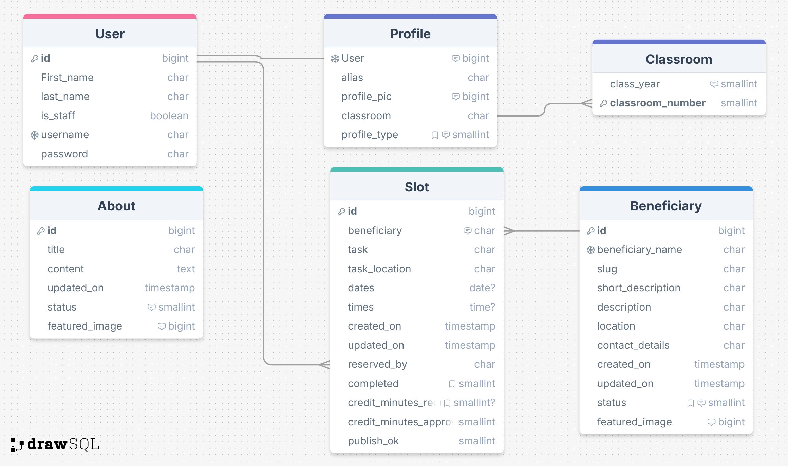

# Be a Dear - Volunteer

## Description
Be a Dear - Volunteer is a web-based application designed to allow high school students to plan and track their volunteer hours. Traditionally, students must volunteer for public-facing organizations in order to have their volunteer time approved for creditThe site lists a number of potential beneficiaries and also includes the beneficiary categories of "Other" and "Individual" so that students can track volunteer time even for beneficiaries not explicitly listed on the site.

## Purpose

## User Stories

## Features

### User Profiles

User profiles are created upon the creation of a user account using signals, and users can then update their profiles to add their homeroom number and upload a profile picture (which only shows on their own page).

### List of beneficiaries

Students can browse a list of beneficiaries with short descriptions and locations, with a link to read more about each and to add the beneficiary to their dashboard for planning their volunteer activities. The list includes the beneficiary categories "An Individual" and "Other Organization or Group" so that students can plan volunteer activities not included under an already listed beneficiary. Through the contact form on the About page, students can send suggestions for posting opportunities they know of so other students can become aware of them.

### Task creation

On the beneficiary details page, users can read more about volunteer opportunities involving a particular beneficiary, find contact information to investigate further, and can enter information concerning the task they plan to (or have already) performed for that beneficiary. Here, users fill in a short task description and task_location (as this might differ from beneficiary location), and optionally, the date.  

### Student dashboard

Here students can track, edit, update, or delete their planned activities ("slots"), which appear on their own pages under the rubriques Planning, Completed, Credit Requested (in terms of minutes), and Teacher Approved (in terms of minutes credited). They also see their total minutes credited.
Under the Teacher Approved rubrique are displayed both the minutes of credit requested by the student and the minutes of credit approved by the teacher, so that any discrepancies can be discussed by the teacher and student and then resolved, as teachers will not necessarily want to approve the same number of minutes requested by the student.

### Downloadable Signature Forms

Credit for volunteer work by high school students in the State of California, as a matter of fact and not merely by the design of this project, requires proof in the form of signatures and contact details of the beneficiary. (For this reason, students have traditionally been limited to volunteering for public-facing organizations or institutions.) Students will be able to download signature forms to provide a basis for teacher approval of their volunteer hours.

### Teacher approval in the admin panel

Teacher ability to approve their students' activities and hours and minutes for credit toward graduation on the backend. Teachers receive the is_staff attribute on the backend by the superuser and are given the ability to log in to the admin panel, where they can sort students by homeroom to make the approval process easy.

### Homeroom page counter
Showing total minutes of volunteer time completed and approved by the students in the class as a whole.

## Data Models

### Entity Relationship Diagram

Please note that all fields descriptions were not available for use through the DrawSQL site (at least the free version). Image fields in the About, Profile, and Beneficiary models should indicate BLOB for type, rather than BigInt.

##Validation

Javascript files were run through JSHint and passed with no errors. No changes have been made to the js files after being passed through the linter.

## Bugs

The Slot Form is not posting to the database. For the time being, I am removing the date and time fields in slot sign-up, as these are not needed at this stage. The student is expected to add and edit these fields as the planned activities near or take place. One form will be used for adding the slot to a student's dashboard, where the student will then have access to a more complete form for filling in the details of the slot as their plans become more concrete or even after they have completed the activities.

The signal was not working to create a profile. Thanks to tutor support for helping me pinpoint the problem(s): I had unnecessarily imported the User model at the start of the apps.py file in the users app where I was importing users.signals in the AppConfig function below, and I kept getting an error in the terminal that my apps weren't loading, so although I strongly suspected the issue was with the apps.py file (after reading the django documentation), I wasn't able to see what was _causing_ the error being raised. I wasn't aware that unnecessarily importing a model somewhere could cause such havoc! Also, I had created my Profile model (OneToOne with User) with a field for "alias" set to unique, and I had overlooked the fact that upon _creation_, the field would need to be populated with _something_, rather than only upon update by the user as I had planned. The reason that the unique field in the model was a problem seems obvious to me now: the Create.object code called by the signal would need to populate the field with something, and Django would only populate a field with the same Null value if there were no default, but since the field was supposed to be unique, both criteria could not be met. I was essentially learning how to deal with a OneToOne model while coding, so my understanding evolved through the learning process. In any case, the unique field was actually unnecessary for my purposes in the end. I have kept the field with a default of "Someone", to be used in an expansion of the project, where the user will be able to enter an alias if they wish. For now, profiles will be dealt with on the back end. Again, many thanks to Code Institute's tutor support for helping me understand the issue. My misunderstanding arose from the fact that I didn't have clear in my mind how the create_profile function (now renamed edit_profile!) was related to the Create.object.profile() function being called by the signal sent by the user upon creation of the user account. Changing the field to default "Someone" in the model had no drawbacks, as the purpose for which it was intended (student privacy together with student identification to teachers) can be maintained by what I choose to display on the front end.

The slot form on the beneficiary detail page was prepopulating the form with the fields of an object after clicking the edit button for that object, but saving the form created a new object instead of updating the object. I first tried rewriting the function `edit_slot` in the view. My reasoning was that, even though the form used to edit or create the slot, lacking the field for beneficiary, would not allow a user to change the beneficiary of the task (which is a related model, and set upon creation of the task), by leaving beneficiary out of the original code in `edit_slot`, I was somehow causing the edit form to create a new slot each time. I had left out the beneficiary in the function because my reasoning was that I was passing the slot id into the function already, so that the beneficiary was already defined (and inaccessible in the form as well). In any case, revising the 'edit_slot` function did not work, although I decided it was still important to have the code regarding the beneficiary in the function, as I had done for the function to create a slot. Next step is to have a look at the javascript, as I note that the "Save to Dashboard" button does not change to "Update", as it should with proper running of the js code, so that is a clue that the problem lies there. First, because I was getting a warning in my terminal about duplicate tables in my database potentially causing my program to not work properly, I took measures to clear the database of all data, remigrate and register the models, and create a new model to replace the one (which I hadn't implemented yet anyway) that was causing the warning. This did not solve the current bug. The javascript is throwing errors in the terminal, so I have been addressing them one by one. Earlier, the form couldn't populate because I wasn't displaying all the fields on the page that were included in the form. That has been fixed. The javascript also did not like if a field was empty, as it couldn't read a null value. I revised to models to include some default text for those fields, which had the added positive effect of letting users know what they could or should enter there (and that it was ok to fill those in with specific details later). After fixing some typos in the js file, I was able to get through the js function all the way to my console message of "The function has completed!" (not for the first time), but the behaviour of saving a new slot instead of updating the old one persisted. Then this same error showed in the console. The script seems to get hung up on similar lines in the function, but not always the same ones, with the following message:
`Uncaught TypeError: Cannot read properties of null (reading 'innerText')
    at HTMLButtonElement.<anonymous> (slots.js:24:109)`
Looking more closely at the html in the browser using dev tools, I can see that the values that javascript is supposed to be setting are not being done. That is, they show in the form on the screen, but the values shown in the html under "value" are not changing as they did before. When I had a simpler form with just the task and task location, this worked. Now no values in the form change when the edit button is clicked, even though the form displays the slot and any edits that are made. So I'm beginning to think there's a problem binding the data to the form, and I'll be taking another look at the view tomorrow.

## Bugs Fixed

Errors occurred in the terminal after writing new javascript, but the errors pointed to the older javascript that had been working fine up until that point. On the student dashboard page, the javascript would not run through to the end to complete the function relevant for that page. Those errors indicated a problem with the bootstrap delete Modal, which is used on a different page for editing slots. And on that other page, where the javascript was being used to prepopulate the form to edit a slot, an error was being thrown which referenced the javascript for the dashboard. I did not notice that second fact at first, so I was thinking that perhaps there had been some update with bootstrap that I would need to take into consideration, as the error pointed not only to my js file, but to the bootstrap script as well. But as I discussed the issue with Holly at Code Institute Tutor Support, I discovered the fact about the other webpage displaying a related (but reverse) error, and at Holly's suggestion, I split the javascript into separate files, each targeting only the relevant page or pages. Problem solved! Thank you, Holly!

## Credits

A million thanks to Kay at Code Institute for her encouragement and guidance during our weekly standups! It made the whole experience of developing this app a whole lot less daunting--and more fun! And just because this thanks is short, I really mean it when I say that her smiling face each week and her sharing of knowledge have really made this course for me.

Many, many thanks as well to my mentor, Juliia, who quickly pointed out, during our mid-project session, that a feature I was bent on including in my project would simply have to be put on the back burner until after the project submission and that I'd better focus on the must-haves to make the deadline. I was reluctant to take that advice at first, but she was absolutely right. There were a lot of details to take care of, and I would not have made the deadline if I'd not taken her advice. (She also gets credit for my contact form not allowing an empty name or message field. A small detail that I'd overlooked when creating the model, and which she said I could skip and mention here as a future improvement, but it was an easy fix, so it's done.) 

And of course, many thanks to Code Institute's Tutor Support. I wish I'd made more use of you, especially in the early to middle stages, because whenever I did you saved me a lot of time! After staring at my javascript for what seems like forever, it took one of you just a minute to see where I'd accidentally left out a "let" before a variable. I swear I read over that code a million times and just couldn't for the life of me find that one error. I've learned there's a fine line between using descriptive variables and making variables so long that it's hard to see mistakes in the code. What a difference a second pair of eyes makes.

For the view code for the beneficiary details page, I borrowed heavily from the Codestar walkthrough project, although it has been adapted to my purposes.

The pagination code on index.html is also heavily based on the Codestar project.

Favicon: The favicon was obtained from flaticon.com at <a href="https://www.flaticon.com/free-icons/volunteerism" title="volunteerism icons">Volunteerism icons created by gravisio - Flaticon</a>

