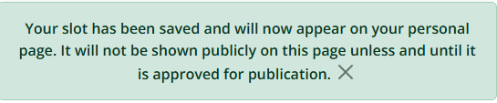
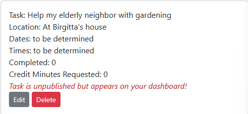

# Be a Dear - Volunteer
A Django project utilizing Python, JavaScript, HTML, CSS, and PostgreSQL.

Links to the deployed app and the GitHub repository:

[Be a Dear app deployed on Heroku](https://be-a-dear-volunteer-10d02942fbed.herokuapp.com/)

[Be a Dear GitHub repository](https://github.com/ChristineEC/be-a-dear-volunteer)

## Table of Contents
- [Description](#description)
- [Purpose](#purpose)
- [Agile Methods](agile-methods)
- [Features](#features)
    - [General Overview](#general-overview)
    - [Features in line with user stories](#features-in-line-with-user-stories)
        - [Home Page](#home-page)
        - [Header and Navigation Bar](#header-and-navigation-bar)
        - [Logged In Status](#logged-in-status)
        - [Viewing opportunties on the Volunteer page](#viewing-volunteer-opportunities-on-the-volunteer-page)
        - [Saving tasks to register and plan volunteer activities](#saving-tasks-to-register-and-plan-volunteer-activities)
        - [Full CRUD: Creating, reading, updating and deleting tasks](#full-crud-creating-reading-updating-and-deleting-tasks)
        - [Managing tasks from the dashboard (RUD)](#managing-tasks-from-the-dashboard-rud)
        - [Checking student progress](#checking-student-progress)
        - [Profiles](#profiles)
        - [Read about the project](#read-about-the-project)
        - [Sending messages](#sending-messages)
        - [User messages](#user-messages)
        - [Footer](#footer)

## Description
Be a Dear - Volunteer is a web-based application designed to allow high school students to plan and record their volunteer activities and to request credit toward their graduation requirement, which is typically 20 to 30 hours for high schools in California.

The application is designed to be managed by a student, administrator or teacher of a school, with teachers able to approve credit on the backend. Students are usually required to volunteer at public-facing organizations. The idea behind the project is to allow students to volunteer in non-traditional ways, such as by assisting a private individual in their community, such as an elderly, disabled, or injured neighbor. In addition to being able to volunteer for private citizens, students are allowed to volunteer for as little as five minutes at a time as part of the fictional project.

## Purpose
The purpose of the project is to allow high school students, who must volunteer 20 to 30 hours to meet graduation requirements in California, to volunteer in 
- non-traditional,
- more fun, 
- convenient, and
- personally meaningful ways;
- more locally and 
- for smaller increments of time.

Traditionally, students must volunteer for public-facing organizations, such as at a soup kitchen, food bank, animal shelter, or environmental group, in order to have their volunteer time approved for credit. In reality, many students never complete their hours but instead have their parents sign off on work never done. A quick Google search of the issue reveals that many, if not most, students consider the requirement just an additional hoop to jump through in order to graduate; many resent the requirement and gain little from their experiences, much less any motivation for future volunteerism. 

Secondly, the COVID-19 pandemic caused increased mental health issues among teenagers, so another purpose of the project is to 
- improve the mental health of students. 

It is well-known that when people help others, even in tiny doses, it increases their own happiness and self esteem.

Finally, college acceptance is extremely competitive in California, especially for the cheapest schools, the public universities, which are also the highest ranked in California. Colleges do look at the extracurricular activities of applicants, including their volunteer experiences, and they read college application essays as an important part of the screening process. 

It is hypothesized that students who volunteer by helping an elderly neighbor on a regular basis, for example, will have more to say about their experiences on a college application, potentially helping their chances of acceptance. One of the (actually) stated rationales behind having students volunteer is that they will gain experiences in the public sphere that can help them in future employment. While this may be the case (for a very small number of cases, I'd venture to guess, as many students work part time jobs anyway), it is my belief that experiences of real people and real problems in their communities would be of more benefit, especially when it comes to an awareness of society as a whole. While traditional volunteer experiences have much to offer, I think that the gulf between teenage volunteers and those helped is often too wide for the experience to give real personal meaning, especially to someone carrying out the work begrudgingly. Teenagers may simply have difficulty identifying with their beneficiaries when they are so far removed from them socially, and when they receive little personal feedback. It is thought that more regular experiences with people closer to them in the community, on a regular basis, could yield more meaningful experiences due to the immediacy and social intimacy of the personal relationships formed. The hope is that students, who can be quick to reject externally imposed notions of morality, will come to enjoy their encounters and will learn an important fact about being human: that a great reason for helping others is that it makes us feel good, too.

## Agile Methods
The project was developed using agile methods. User stories were used to define the requirements, and these were tracked as issues on a Kanban board as a project in GitHub connected to the Be a Dear project repository. Labels were used to distinguish the different user stories as, for example, "must have", "should have", and "won't do". In addition to columns for To Do, In Progress, Done, and Won't Do, I used a column for Styling in Progress, which I found extremely helpful, at the suggestion of my mentor.

## Features

### General overview
The Be a Dear project as a whole contains three apps:
1. The Volunteer app: houses all front-end CRUD. 
    - Models: Beneficiary, Slot, Classroom 
        - Beneficiary and Slot, together with Django's allauth User model, provide full front-end CRUD
        - Classroom enables teachers to sort user profiles (see below) by Classroom in the admin panel.
    - Templates:
        - index.html "Home"
        - volunteer_opportunties.html "Volunteer"
        - beneficiary_detail.html **(full CRUD)** - slug
        - student_dashboard.html **(RUD)** "My Dashboard"
        - update_task.html (RUD) - Edit buttons on dashboard
    - Forms:
        - SlotForm (full CRUD in one template, RU in another)
2. The About app
    - Model: About
    - Form: CollaborateForm (embedded in about.html and freestanding in contact_form.html)
    - Templates:
        - about.html
        - contact_form.html
3. The Users app
    - Model: Profile
        - Linked to Django allauth Users model (OneToOne) and to Classroom model in the volunteer app.
    - Function: Teachers can sort by classroom in the admin panel; students can read what Classroom they are assigned to.
        - Although the Profile model provides only limited (back-end) functionality at the current stage of this project, it does allow for rapid development of future enhancements.

### Features

#### Home page
The home page acts as a landing page, providing a brief but clear and comprehensive introduction to the purpose and general functionality of the website.

#### Header and Navigation Bar
The header consists of a simple logo and the name of the project, clickable to return the user to the homepage from any page.

The nav bar is fully responsive, appearing as text on wider screens and as a navbar "hamburger" icon on smaller screens

The content of the navbar changes depending on whether a user is logged in or out.

Current page shows as bolded in the navbar

#### Logged In Status
A user is told that they are logged in as `<username>` or that they are not logged in at the top of every page, just under the navbar.

#### Viewing volunteer opportunities on the Volunteer page
The Volunteer page consists of three sections
- A header that shows what the page is about and simultaneously promotes (or at least encourages!) student engagement with the project.

- How it Works section
Explains what students can do and how they can do it, displaying prominent links to giving further visual overview of the site.

- List of beneficiaries
With obvious links begging to be clicked.

#### Saving tasks to register and plan volunteer activities
When the user clicks on a beneficiary on the volunteer page, they are directed to that beneficiary's detail page, which also contains a prominent form for saving a task related to that beneficiary to their dashboard.

#### See what others are doing
On each beneficiary's detail page, students can see how many students have saved or completed tasks for that beneficiary, and what those tasks look like (if they are published!).

#### Student privacy
In the image above, note that users names are not displayed. A future feature would allow aliases to be displayed. The Profile model is already set up to do this. Students would be made aware that if they wished their activities to remain private, they could leave their alias as the default "Someone". Otherwise, their chosen alias would be displayed, and it would be up to them who they revealed their alias to. Teachers would be able to see on the back end, of course, as they would have access to all users and profiles.

#### Full CRUD: Creating, reading, updating and deleting tasks
The form on each beneficiary's page allows users to create and update "tasks", known as slots on the back end.

On the same page, users see their own slots, with edit and delete buttons.

Clicking on edit prepopulates the form, and when the user clicks on Update, the object is saved in the database and immediately appears as edited on the same page (and in the dashboard, of course).

Clicking the update button results in the slot being updated and a success message showing.

Clicking on delete brings up a delete modal.

Successful deletion displays a message.

#### Site admin control of what is displayed
When a user updates a task that has been published, the task reverts to unpublished.

#### Managing tasks from the dashboard (RUD)
Part of the student dashboard is shown here. Students can read, update and delete tasks and be returned to the dashboard.
The tasks are color coded by status (planned, completed, credit requested, or credit granted). In case a student doesn't mark an assignment as complete but still asks for credit, that task will appear in a red row. (It doesn't have any material bearing on the time calculation anyway, so it's not something they actually need to fix. This was created as a catch all in case a task is not caught by the if/else statements used to create the differentiation by color. This could be the only logical case.) Future enhancements should eliminate this possibility.

Clicking on edit for a task brings the user to the update_task.html page. It was important that users be able to update tasks here and be redirected right back to the dashboard, rather than being directed to the page where they created the task. The user receives a success message (as shown above) after clicking the update button.

Clicking on delete brings up the same modal as above and the user is provided with the same success message as for deleting from the beneficiary page.

#### Students can keep track of their progress
Total minutes and hours volunteered, total required, and total remaining appear at the bottom of the students' dashboards.

#### Profiles and Classrooms
User profiles are created on the back end, in a OneToOne relation to Django's allauth Users model. On the front end, anyone with a profile can see what classroom they've been assigned to. If they don't have a profile, they are informed that a profile has not been created yet but that they still enjoy full functionality on the site and they can message (with a link) to ask for one to be created. This was a good example of agile development. I made sure to make the crucial functionality independent of the profile model. Users enjoy full functionality regardless of whether they have a profile or not, and teachers can still update their credit approvals on the back end.

On the back end, teachers can sort profiles by classroom to quickly get an overview of their students who have registered and have profiles. Classroom numbers were made the primary key of the classroom model for this purpose. Even if the project were expanded to multiple schools, the 10 character limit (Char field) on the attribute is sufficient to allow for distinguishing between schools and adding many, in case a district decided to implement, for example.

Profiles are incredibly easy to create for users because they appear inline with the User model on the back end, whether creating, viewing, or updating a user profile.

- **Future functionality:** Together, these two models could provide some interesting functionality, such as competitions between classes and between class years, and even between schools in a district.Teacher pages with the ability to grant credit on the front end would be possible, as well as the ability of users to upload profile pictures. In future development, profiles should be created automatically through signals when users register. As soon as a user creates an account, they would be directed to a form or a pop up asking for their profile information. At the very least, profiles should be created in the database through signals with the available default fields saved, and then users could edit their profiles quite easily via a form.

#### Read about the project

On the home page and the about page, all site visitors can become acquainted with the project. Through the About model, the site admin can update the About page at will, saving drafts in the admin panel and publishing when desired. The most recently "published" About object is the one shown on the page.

#### Sending messages
There is a form on the About page for sending messages to the site admin(s). Filling it in sends a message, which the site owner can mark as read to keep track of things, and the user is returned to the About page.
Links throughout the site bring users to contact_form.html page, where they can also send messages from. Filling out this form sends users to the homepage afterward, which is not ideal. Future enhancement would send them back to the page they came from.

#### User Messages
Prominent messages are displayed to the user when they interact with the website:

Sign in success

Sign out Are You Sure?

Sign out success:

Sent message (from all relevant links and pages):

Wrong username and password or 
Not registered yet but trying to sign in

Creation of a task from the Volunteer page

- and after publication:

Task Updated!

Deleting a task

- first the delete modal

- then delete success message

#### Teachers' approval of credit for students
Teachers are identified as such on the back end by the superuser--both by labeling them as "staff" with Django's built-in User model and by changing their default profile type to "teacher". After being given the relevant privileges there, teachers are able to view their students' requested hours and approve them, either for the full amount requested or some other amount, as they deem creditable. (After all, high school students are known to exaggerate!)

#### Footer
The footer is designed to be changed out by the particular school using the app. I have included two external links for good form, but schools will want to keep everything in-house, and would probably include links to the school's home page and such.

#### Favicon
The favicon, a simple heart, was obtained from . A future improvement would be to use one with better contrast for people using dark mode.

## UX

The design of the website is simple and straightforward. Future functionality, such as the ability of students to post about their experiences, share photos, etc., would likely merit enhanced design, but for the scope of this project, simplicity is key.

- Colors: The color scheme is simple and clean: black and white, with some light pink background in places which helps break up the page into easily recognizable sections while maintaining good contrast with the font color (universally black, except when white on a black background). The pink coordinates with the valentine candy heart image on the home page, all in line with the intentional corniness of the title. (One mustn't be too earnest with teenagers!)

- Fonts: The main font used is open-sans for easy readability and clean presentation. The exception is the use of Graduate in the navbar as a nod to the high school milieu, and the limited use of Cabin Sketch on the dashboard page, as it looks like a student's doodle on a notebook or like block letters written with chalk on a chalkboard. I also used Bootstrap's "display-1" through "display-6" classes, as I found them, with their narrow line width and increased size, to be a more effective means of communicating messages quickly and at a glance--that is, succinctly and without shouting, as with bold font.

- Quick, intuitive navigation: Students will want to quickly find what they are looking for and be able to navigate freely and intuitively from the different pages, being redirected to where they started out after completing a task in the app. For this reason, the site was developed so that students are able to read, edit and delete their tasks from two different places on the site. 
    - From the beneficiary detail page they can quickly add tasks to their dashboards without worrying about including all of the details. They can create, read, update and delete from there, without ever having to leave the page. 
    - This means they can quickly add a number of tasks related to the different beneficiaries to their dashboards for later updating as they wish. 
    - Later, from their dashboards, they can read, update and delete their tasks, filling in the details and requesting credit as they go. Editing or deleting from the dashboard returns the student to the dashboard, and editing or deleting from the beneficiary detail page keeps users on the beneficiary detail page.

- Easily visible, convenient links: Other links are also made convenient. Any visitor to the site can send a message by clicking on "Contact Us" in the navbar, by clicking on an inline link on the homepage, or by filling in the form on the About page. All users have access to the Home, About, and beneficiary details pages (accessed by clicking on a beneficiary). (Only logged in users can save tasks to a dashboard.)

- The navbar includes only those links that are relevant to the user. Non-logged-in users see Home, About, Contact Us, Register, and Log In. Logged in users see Home, About, Contact Us, Log Out, and My Dashboard. All visitors to the site see a message under the navigation items either telling them that they are logged in as ( their username) or that they are not logged in, as the case may be. The message is shown on all pages.

- Clear messages are displayed to users indicating the results of any action taken by them, such as successful creation, updating or deleting of slots, or alternatively, if they try to visit a page to which they don't have access by typing in the url. 404 messages are in place as well. Delete modals are used to warn users before they delete anything.

- Pagination is not used, as most students are expected to be accessing the site on their mobile phones, where infinite scroll is more convenient. If any enhancement were to be made in the future, it might be the ability to search for an organization by name or by first letter by clicking on letters of the alphabet, but this would only be useful if there were to be very many organizations, and this would not be expected to be the case. In any case, the current scope of the project does not merit this.

- Privacy: Privacy is maintained, as usernames and information about planned tasks, etc., are never shown (at least not by name) on the pages that are not strictly personal to the logged in user. (In a future version of the app, aliases could be displayed on public pages, based on the aliases users choose for their profile.)

- Crispy forms were used to style all forms, including the login, register, logout, contact, and CRUD operations.

- **An important change:** One very important change that I made at a late stage in development, one that I think resulted in vast improvement in UX/UI, was that I moved the list of beneficiaries from the homepage to its own page, called Volunteer. Before that change, visitors to the home page had no clear idea of what the website was for, and the navbar, lacking the now prominent "Volunteer" didn't provide a lot of clues. Splitting the two pages up had occurred to me earlier in development, but cognizant of time, I thought I could manage okay without the change. How wrong I was! At the urging of my mentor, just days before submission of this project, I made the change and am so glad I did.

I recognize that there is vast room for improvement in the visual design of the site. I hope the ease of navigation and clear messaging make up for some of it!

## Agile Development Method

## Wireframes

My earliest wireframe was created using [Balsamiq](https://balsamiq.com/), but my free trial period ended before I was ready to use it here, so I am including a downloaded image of it here:

More extensive wireframes were done in Miro (below). The home page differs from the design, as I was advised to include more explanatory information about the app on the homepage, so another section between the header and the list of beneficiaries was added.

## User Stories
A site visitor can 
- read about the project on the home page and on the about page
- can send messages from either page through a contact form.

A site visitor can log in and create an account to:
- read about volunteer opportunities
- read about what other students have signed up for
- see a count of how many students have saved and how many have completed tasks related to a specific beneficiary
- save opportunities (i.e., create "tasks" related to a beneficiary) to their dashboard
- create, read, update and delete tasks from the beneficiary detail page
- manage their tasks (read, update and delete) from their student dashboard
- request credit by updating the fields "completed" and "credit minutes requested" on the update form (or from the Volunteer page wherefrom they saved the tasks)
- quickly see (via color coding on the dashboard) which tasks are planned, or completed, or have credit minutes/hours requested, or have already received credit
- compare the amount of credit received with the amount they requested (in case they want to argue their case for more minutes of credit!)
- see how many hours and minutes of credit they have received in total
- see how many more minutes or hours they must complete toward graduate
- see whether they have been assigned to a classroom, and if not know what to do if they haven't
- send messages to the site owners to suggest the posting of new volunteer opportunties, or for help with a forgotten password
- log out

The superuser can:
- designate certain registered users as "staff" (from the is_staff attribute from Django's allauth), to allow them to access the admin panel
- designate those users as either teachers or school admins and give them restricted privileges in the admin panel
- assign classrooms to the teachers (or a default "unassigned" classroom 999 in the case of school admins)
- create a user profile for any user, inline in the admin panel, assigning classrooms to students and teachers, and uploading profile pictures for display on student dashboards
- Create, read, update and delete beneficiaries and tasks, as well as users and profiles
- create, read, update and delete text for the About page, including uploading images
- mark received messages as read in order to keep track of what has been done (or answered)
- add classrooms for the project (create, read, update and delete functionality for this)

A teacher can:
- log in as a regular user and enjoy full functionality as if they were a student
- get access to the admin panel, once approved by the superuser
- be given the ability to approve students' requests for credit (i.e., can update slots)
- approve either the amount requested or a different amount, as the fields for credit requested and credit approved are distinct
- read information about all beneficiaries, slots, homerooms, users, and profiles on the back end
- sort profiles by classroom to see a list of all students in a classroom that are registered
- check if a student has been assigned a homeroom
- send a message through the admin panel
- read messages in the admin panel

### List of beneficiaries

Students can browse a list of beneficiaries with short descriptions and locations, with a link to read more about each and to add the beneficiary to their dashboard for planning their volunteer activities. The list includes the beneficiary categories "An Individual" and "Other Organization or Group" so that students can plan volunteer activities not included under an already listed beneficiary. 

Through the contact form on the About page, students can send suggestions for posting opportunities they know of so other students can become aware of them.

### Task creation

On the beneficiary details page, users can read more about volunteer opportunities involving a particular beneficiary, find contact information to investigate further, and can enter information concerning the task they plan to (or have already) performed for that beneficiary. Here, users fill in a short task description and task_location (as this might differ from beneficiary location), and optionally, the date.  

### Student dashboard

Here students can track, edit, update, or delete their planned activities ("slots"), which appear on their own pages under the rubriques Planning, Completed, Credit Requested (in terms of minutes), and Teacher Approved (in terms of minutes credited). They also see their total minutes credited.
Under the Teacher Approved rubrique are displayed both the minutes of credit requested by the student and the minutes of credit approved by the teacher, so that any discrepancies can be discussed by the teacher and student and then resolved, as teachers will not necessarily want to approve the same number of minutes requested by the student.

### Teacher approval in the admin panel

Teacher ability to approve their students' activities and hours and minutes for credit toward graduation on the backend. Teachers receive the is_staff attribute on the backend by the superuser and are given the ability to log in to the admin panel, where they can sort students by homeroom to make the approval process easy.

### User Profiles

Users can have profiles that consist of a profile picture, classroom to which they belong (relating to a separate classroom model), profile type (student, teacher, or school admin), and alias, which defaults to "Someone". The classroom attribute is the most important attribute of the model because it allows teachers to quickly identify on the back end which students they want to validate slots for. The superuser changes any teachers' profile type from the default student to "teacher" and then manually gives the teachers various permissions on the admin panel. When a teacher later accesses the admin panel, they can sort profiles by homeroom to view the students they are interested in.

At the moment, profiles are handled entirely on the back end. Thanks to being registered as inline with the user model in the admin.py file of the users app, profile creation is straightforward. When a new user is created in the admin panel, or when a previously added user is viewed, the fields for the Profile model appear as well, so the superuser can assign the correct profile attributes, such as homeroom, or a profile picture that differs from the default. See future enhancements for more about user profiles.

## Future enhancements

- Profiles auto created through signals

- Homeroom page counter showing total minutes of volunteer time completed and approved by the students in the class as a whole.

- Downloadable signature Forms: Credit for volunteer work by high school students in the State of California, as a matter of fact and not merely by the design of this project, requires proof in the form of signatures and contact details of the beneficiary. (For this reason, students have traditionally been limited to volunteering for public-facing organizations or institutions.) Students will be able to download signature forms to provide a basis for teacher approval of their volunteer hours.

## Data Models

### Entity Relationship Diagram

Please note that all fields descriptions were not available for use through the DrawSQL site (at least the free version). Image fields in the About, Profile, and Beneficiary models should indicate BLOB for type, rather than BigInt.

## Validation

### CSS

### HTML
Early attempts at validation revealed a number of issues with the HTML. In particular, because several of the project's models use Summernote fields, and these are rendered in HTML templates as paragraphs, each place I had wrapped a tag referring to those object attributes with my own paragraph in the html, this caused an error of having a paragraph wrapped in another paragraph, which is nto allowed in html. Thta is, my original html looked like this `
<{{beneficiary.beneficiary_description | safe }}
`. I resolved this error by changing my own paragraph tags to article tags. Another widespread error was that bootstrap's "card-text" class was setting the font-face to Aptos, which is no longer supported. I used CSS to override that, setting the font back to my open-sans preference with an `!important` tag for any element (or child of an element) with class "card-text".

### Javascript

Javascript files were run through JSHint and passed with no errors. No changes have been made to the js files after being passed through the linter, except to remove the coded out first line, visible in the images below, needed to run the linter for ES6.

### Python

Python files were run through the Flake8 linter, with the results shown below. Files created by Django, such as migrations or tests.py were ignored. There are no outstanding errors from any files that I created or edited. I decided it was safe to ignore the errors thrown by tests.py files from the apps, as they involved only the unnecessary import of TestCase from the django test library, and I will need that import if I decide to do automated testing at a later date. And although I probably didn't need to, I went ahead and ran manage and env python files through the linter as well. As you can see, the only errors were for line length in the env file, but my attempt to resolve those led to errors connecting to the database, so I decided to return the file to its original long-line-length form. For some reason, my editing of the slot model simply for line length during cleanup in response to an error shown by flake8 caused django to consider the model altered (which I discovered by running makemigrations --check), so I decided, before running the migration, to also make a last minute change to a char field in the beneficiary model, increasing its max-length, before running the migration. Therefore, I ran the volunteer app through flake8 again, with no errors. The newest result is shown below.

[Results for manage and env files](flake9-manage-env.png)

## Credits

A million thanks to Kay at Code Institute for her encouragement and guidance during our weekly standups! It made the whole experience of developing this app a whole lot less daunting--and more fun! And just because this thanks is short, I really mean it when I say that her smiling face each week and her sharing of knowledge have really made this a positive experience.

Many, many thanks as well to my mentor, Juliia, who quickly pointed out, during our mid-project session, that a feature I was bent on including in my project would simply have to be put on the back burner until after the project submission and that I'd better focus on the must-haves to make the deadline. I was reluctant to take that advice at first, but she was absolutely right. There were a lot of details to take care of, and I would not have been able to finish in time if I'd not taken her advice. (She also gets credit for my contact form not allowing an empty name or message field. A small detail that I'd overlooked when creating the model, and which she said I could skip and mention here as a future improvement, but it was an easy fix, so it's done.)

And of course, many thanks to Code Institute's Tutor Support. I wish I'd made more use of them, especially in the early to middle stages, because whenever I did they saved me a lot of time! After staring at my javascript for what seems like forever, it took someone from tutor support just a minute to see where I'd accidentally left out a "let" before a variable. I swear I read over that code a million times and just couldn't for the life of me find that one error. I've learned there's a fine line between using descriptive variables and making variables so long that it's hard to see mistakes in the code. What a difference a second pair of eyes makes.

For the view code for the beneficiary details page, I borrowed heavily from the Codestar walkthrough project, although it has been adapted to my purposes. I also took the code for formatting django generated messages directly from a Code Institute video when I decided at the last minute that my own styling, while it make my messages stand out, left a lot to desire.

#### For images and icons:

<a href="https://www.flaticon.com/free-icons/volunteerism" title="volunteerism icons">Volunteerism icons created by gravisio - Flaticon</a>

<a href="https://www.flaticon.com/free-icons/user" title="user icons">User icons created by Freepik - Flaticon</a>

Linked in icon from FontAwesome: <a href="https://linkedin.com/in/christineecarter" target="_blank" aria-label="link to author's LinkedIn"> 

GitHub icon from FontAwesome<a href="https://github.com/ChristineEC" target="_blank" aria-label="link to author's GitHub">
                                <i class="fa-brands fa-github"></i></a>

