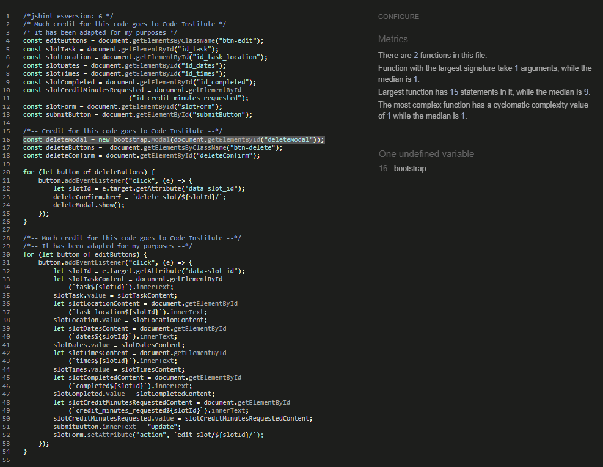

# TESTING
## Table of Contents

[VALIDATION](#validation)
 - [Python](#python)
 - [JavaScript](#javascript)
 - [CSS](#css)
 - [HTML](#html)
 - [Lighthouse](#lighthouse)

[MANUAL TESTING](#manual-testing)
- [Global](#global-1)
    - [Navigation](#navigation)
        - [Navigation bar](#navigation-bar)
        - [Other links](#other-links)
        - [Forms](#forms)
    - [Logged in status](#logged-in-status)
    - [Authentication](#authentication)
- [User Stories and CRUD](#user-stories-and-crud)
    - [General stories](#general-stories)
    - [Full front-end CRUD](#full-front-end-crud)

## Validation
### Python
 was used to validate all Python files. Screenshots of the results follow. I did initially encounter a number of errors in line spacing and indentation, which have been fixed. The only remaining errors, as shown below, are 
- E501 errors (line too long), all for files that were generated by Django, either from the outset or as migrations, and which I have not touched; and 
- F401 errors ('django.test.TestCase imported but not used'), one for each app I created, as Django generates these automatically.
I decided that the F401 errors were unimportant, as they involved only the import of a single model, again, automatically by Django, and I did not want to remove the test files, as I may do automated testing at a later stage. I also consider that it is safe to ignore the E501 errors, as this is the way Django generates the files for all projects, and they are not related to any code I've written or edited myself.

### JavaScript
The two JavaScript files I created for Be a Dear are slots.js (in the static folder of the be_a_dear project) and dashboard.js (in the static folder of the volunteer app). I ran these through JSHint and there are no errors. One comment occurs on each, however, regarding bootstrap--that it is an undefined variable. I believe that this is down to the fact that the linter cannot see what is in the rest of my project, such as the bootstrap script being loaded at the bottom of my templates. I decided that this comment was safe to ignore. The results are shown below.

### CSS
The project has one CSS file, located in the static folder of the be_a_dear project. It passed the  with no errors.

### HTML

### Lighthouse

## Manual Testing
## Global 
### Navigation
#### Navigation Bar
| Feature | Action | Expected Result | Pass or Fail |
|---------|--------|-----------------|--------------------|
| Logo (with text) | click on logo | routes user to homepage (if not already there) | Pass |
| Home | click on "home" on navbar | routes user to homepage | Pass |
| About | click on "about" in navbar | routes user to About page | Pass |
| Volunteer | click on volunteer in navbar | routes user to Volunteer page (beneficiaries.html) | Pass |
| Contact Us | click on Contact Us navbar link | user is directed to about/contact_us url, which contains a form for sending a message | Pass |
| Login | user clicks on "login" on navbar | user brought to login page containing login form *(see also Authentication) | Pass |
| Register | user clicks on "register" | user is directed to accounts/signup url and presented with signup form | Pass |
| Logout | a logged in user clicks on Logout | user is brought to the logout page and the modal "are you sure" appears for confirmation | Pass |
| signout confirmation | user clicks Sign Out on confirmation modal | user is logged out | Pass |
| Navbar visible options | -- | Logged in user sees Logout, and logged out or unregistered user sees Login and Register; all else visible at all times | Pass |
#### Other links
| Feature | Action | Expected Result | Pass or Fail (P/F) |
|---------|--------|-----------------|--------------------|
| Homepage: Inline link to About page | click on link |sends the user to the About page | Pass |
| Homepage: Inline link to "message" | click on link | sends user to the Contact Us form | Pass |
| Homepage: Inline link to Volunteer page | click on link | sends user to the Volunteer page | Pass |
| Homepage: Back button from the above links | click on back button | redirected to Home page | Pass |
| Dashboard (for user with no tasks saved): message link | user clicks link | redirected to contact form | Pass |
| Dashboard (for user with no tasks saved): Volunteer link | user clicks on link | directed to volunteer page | Pass |

#### Forms
All forms function as expected. The actions and results listed below are also included in the relevant places under Navigation, Authentication, and User Stories and CRUD.
| Feature | Action | Expected Result | Pass or Fail (P/F) |
|---------|--------|-----------------|--------------------|
| Login Form ( be_a_dear templates 'account/login.html') | A registered clicks the navbar or other login link on the site  | The form accepts a username and password; if incorrect, it informs user. Links to register and send an email for forgotten password work; user can successfully log in | Pass |
| Logout |  |  | Pass |
| Register |  |  | Pass |
| Slot Form | user fills in the form for creating or updating a slot | If and only if a new slot, new object created in database, if an update, changes are reflected in the database | Pass |
| Update Slot Form
| Collaborate Form | user fills in form and clicks Send | Form sends message and user is notified of success | Pass |

### Logged in Status
| Feature | Action | Expected Result | Pass or Fail (P/F) |
|---------|--------|-----------------|--------------------|
| Logged in Status | Visit site | A logged out or unregistered user sees a message that they are not logged in | Pass |
| Logged in Status 2 | Log in | A logged in user sees a message at the top of every page that they are logged in as <username> | Pass |

### Authentication
| Feature | Action | Expected Result | Pass or Fail |
|---------|--------|-----------------|--------------|
| User login | site visitor clicks on login on navbar | user is redirected to sign-in form at accounts/login url and is able to log in | Pass |
| User logout | logged in user clicks navlink to log out | user brought to logout page and asked if they are sure, then logged out if they click sign out button | Pass |
| User account | visitor clicks on Registration in the navbar | user is directed to the sign up page and can sign up | Pass |
| No log in by unregistered user | A user without an account clicks on login | Sign in fails and user is directed to Register first | Pass |
| Registration - part 2 | user clicks on the inline Register link at login page | user brought to accounts/signup url and presented with form where they are able to register | Pass |
| Prevent non logged in user from accessing the form where they can reserve a slot | user clicks on a beneficiary from the Volunteer page | user is directed as usual to the beneficiary detail page but receives the message that they must be logged in to save a task to their dashboard, and a link to do so. The form to save a slot does not appear. | Pass |
| Student Dashboard access prevention for non-logged-in user | user types in the student_dashboard url | user is redirected to the sign-in page  | Pass |
| Privacy | -- | There is no way to access another person's dashboard, as all user-specific content is coded in templates and javascript, not via separate urls | Pass |
| Wrong password or username | A user types in the wrong password and username combination | A message appears stating that the username and/or password specified are incorrect, and the user can still try again | Pass |
| Forgotten password | User clicks on the forgotten password link | user directed to message form to send message for help, then redirected to home page | Pass |
| Admin panel access | user types in admin url | User asked to authenticate with username and password, denied access unless previously granted by superuser | Pass |
| Admin panel access 2 | user types in admin url | Users gains access, but only for those tasks / priviledges previously granted by superuser | Pass |
| Admin panel 2b | authorized teacher visits admin panel and attempts to change something not authorized | No fields that they should not be able to edit appear as editable | Pass |

## User Stories and CRUD
### General stories
[User stories and Kanban board in GitHub](https://github.com/users/ChristineEC/projects/5)

As a school member, I can create an account and sign-in so that I can participate in the project: Yes. (See [Authentication](#authentication), above).

As a registered user, I can log in and log out with ease. Yes. (See [Authentication](#authentication), above).

As a site owner, I can mark as read messages received so that I can keep track of what needs to be done or messages that need responding to.
| Feature | Action | Expected Result | Pass or Fail |
|---------|--------|-----------------|--------------|
| Messages | user sends a message from the About page or the message or Contact Us links | I can mark the messages as read (or unread) in the admin panel | Pass |

As a site owner, I can post information about an organization or other beneficiary so that visitors to the website can read about volunteer opportunties.
| Feature | Action | Expected Result | Pass or Fail |
|---------|--------|-----------------|--------------|
| Display list of beneficiaries | User visits the Volunteer page (volunteer_opportunities.html) | user sees the list of all beneficiaries marked in the admin panel as published | Pass |

As a site owner, I can post information about the project so that visitors can learn what the project is about.
| Feature | Action | Expected Result | Pass or Fail |
|---------|--------|-----------------|--------------|
| About page | user visits About page | Any user can access the About page, which is displayed in an attractive, legible manner consistent with UX principles | Pass |
| About page admin | superuser drafts content | Most recent published content appears on the about page | Pass |

As a visitor to the website, I can send a message to the site owner so that I can ask them to post a specific volunteer opportunity.
| Feature | Action | Expected Result | Pass or Fail |
|---------|--------|-----------------|--------------|
| Contact form on the about page | user enters a message and clicks on send | Message is received in the admin panel, and user stays on the About page | Pass |
| Contact Us navlink | user clicks | user directed to a Contact Form, then redirected back to homepage; message is received | Pass |
| Message links (see also [Other Links](#other-links)) | user clicks from various places on the website | directed to Contact Form then back to page they came from; message is received | Pass |

As a teacher or school administrator, I can access the admin panel so that I can review students' tasks and approve their volunteer work
| Feature | Action | Expected Result | Pass or Fail |
|---------|--------|-----------------|--------------|
| Admin access | user tries to access admin panel (when not authorized) | user asked for credentials, if not authorized by superuser gets no access | Pass |
| Admin access 2 | authorized teacher tries to change an unauthorized feature in the admin panel | is unable to access fields for editing | Pass |

### Full front-end CRUD
Student creation of slots related to beneficiaries: 
- As a student I can create specific volunteer slots (or "tasks") linked to a beneficiary so that I can reserve the slot (i.e., save to student dashboard)
- As a student I can edit my slots so that the slots accurately reflect my volunteer work
- As a student I can delete any slot that I have reserved so I can remove the expectation that I will fulfill it
- 

| Feature | Action | Expected Result | Pass or Fail |
|---------|--------|-----------------|--------------|
| Reserve a task | fill in form and click "save to dashboard" (beneficiary_detail.html template) | an object is created in the database, with the "reserved_by" attribute equal to the requesting user, and appears on that student's dashboard | Pass |
| Edit a task where created | user clicks Edit button on the page where they saved the task (beneficiary_detail.html template) | the form is prefilled, editable, and can then be saved; it updates the object in the database and shows correctly on the user's dashboard | Pass |
| Delete a task from where created | user clicks Delete button on the page where they saved the task (beneficiary_detail.html template) | Delete modal appears asking if they're sure, and if they click delete, the object is deleted from the database, and thus everywhere on the site | Pass |
| Edit slot from dashboard | user clicks on edit button next to the slot on the dashboard | user is directed to prepopulated Update Slot Form and can successfully edit the slot there then be returned to the dashboard | Pass |
Delete slot from the dashboard | user clicks on delete button next to the slot on the dashboard | a modal appears warning the user that the deletion will be permanent, with a button to proceed (or cancel); if delete is clicked there the object is successfully deleted and the user stays on the dashboard | Pass |

As a student I want to be able to record my volunteer time(s) so that I can include them in requests for credit.
| Feature | Action | Expected Result | Pass or Fail |
|---------|--------|-----------------|--------------|
| Request credit | student fills in number of minutes they are requesting credit for, or uses date and time (char) fields to enter additional days and times for the same task before requesting credit | slot is updated and teacher and student can see this clearly (student sees which slots they've requested credit for that have not yet been approved vs. those approved) | Pass |

Student dashboard: As a student I can see all of my slots on my own page so that I can keep track of my obligations and credits
| Feature | Action | Expected Result | Pass or Fail |
|---------|--------|-----------------|--------------|
| Student Dashboard | student clicks on My Dashboard (or a dashboard link--see [Other links](#other-links), above) | If the student has tasks saved, they see a table containing all slots they are signed up for, color coded by "planned", "completed", "credit requested" and "credit received". (Students with no slots see a box stating that that is where their slots will show and presenting them with a link to the volunteer page to start saving tasks.) Total time credited, total time required, and remaining time needed are summarized below the table | Pass |

